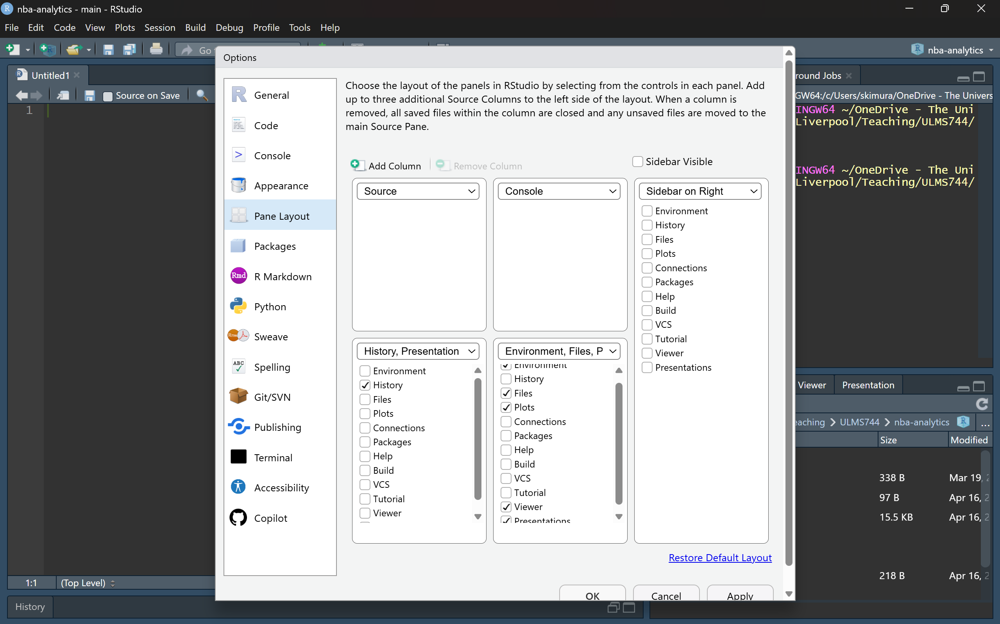

AI coding assistants that live inside your terminal have become a standard part of the modern data-science workflow. This workbook walks you through installing **Claude Code** — Anthropic's official CLI — and points out that the setup is essentially the same for **OpenAI's Codex CLI**, which is a direct alternative. By the end you will be able to open a terminal in any project folder, type a single command, and start working with an AI assistant that can read and edit your files.

::: callout-warning
### A paid subscription is required

Both Claude Code and Codex require a **paid subscription** to the underlying provider to use them for real work:

-   **Claude Code** needs a [Claude paid plan](https://www.anthropic.com/pricing) (Pro or higher) or an Anthropic API account with billing set up.
-   **Codex CLI** needs a [ChatGPT paid plan](https://openai.com/chatgpt/pricing/) (Plus or higher) or an OpenAI API account with billing set up.

Free-tier accounts will not let you sign in to the CLI. Make sure you have an active subscription before following the install steps below.
:::

::: callout-note
You only need to do this setup once per machine. After that, starting Claude Code in a new project is a single command.
:::

::: callout-important
All command-line steps in this workbook use the **Terminal tab inside RStudio** (not the R Console). If you are unsure where that is:


:::

## Learning Objectives

By the end of this workbook, you will be able to:

-   **Install Node.js** and confirm it is working from the terminal.
-   **Install Claude Code** (and optionally Codex) via `npm`.
-   **Launch the assistant** inside a project folder and know the basic shortcuts for interrupting and exiting.
-   **Configure your RStudio layout** so the terminal and source editor sit side-by-side in a way that works well with an AI assistant.

## Step 1: Install Node.js

Both Claude Code and Codex are distributed as Node.js packages, so you need Node installed first.

::: callout-note
### What is Node.js? What is a "package"?

**Node.js** is a program that runs JavaScript code outside of a web browser — on your laptop, directly from the terminal. Think of it as the equivalent of R itself: a runtime that executes code written in a specific language.

**npm** (Node Package Manager) comes bundled with Node.js. It is the JavaScript world's equivalent of `install.packages()` in R — a tool for downloading and installing reusable pieces of software called **packages**.

A **Node.js package** is just a bundle of JavaScript code that someone else has written and published so others can install it with one command. Claude Code and Codex are both published as packages, which is why installing them is a single `npm install` line rather than a multi-step setup.

In short: Node.js runs the code, npm installs the code, and Claude Code is the code.
:::

### Windows / macOS

Go to <https://nodejs.org/> and download the **LTS** (Long Term Support) installer for your operating system. Run it and accept the defaults — there is nothing unusual to configure.

### Check that it worked

Open a fresh terminal (in RStudio: **Tools → Terminal → New Terminal**, or any system terminal) and run:

```{bash}
#| eval: false
#| filename: "RStudio Terminal"

node --version
npm --version
```

You should see two version numbers printed back (for example `v20.11.0` and `10.2.4`). If you get "command not found", close and reopen the terminal — the installer updates your `PATH` and the old terminal will not have picked it up yet.

::: callout-tip
If you are on Windows and the command is still not found after reopening the terminal, restart your computer. This forces every shell to re-read the updated `PATH`.
:::

## Step 2: Install Claude Code

With Node installed, install Claude Code globally via `npm`:

```{bash}
#| eval: false
#| filename: "RStudio Terminal"

npm install -g @anthropic-ai/claude-code
```

The `-g` flag installs the `claude` command system-wide so you can run it from any folder.

Verify the install:

```{bash}
#| eval: false
#| filename: "RStudio Terminal"

claude --version
```

### First launch and login

Navigate into a project folder and start Claude Code:

```{bash}
#| eval: false
#| filename: "RStudio Terminal"

cd path/to/your/project
claude
```

::: callout-note
### What does `cd` do?

`cd` stands for **change directory**. It is the terminal equivalent of double-clicking into a folder in Finder or File Explorer — it moves your current working location to the folder you specify. For example, `cd ~/Documents/nba-analytics` moves you into the `nba-analytics` project folder.

This matters because **Claude Code only sees the folder you launch it from**. Once you run `claude` inside a project folder, that folder becomes the assistant's entire world: it can read, edit, and reason about any file inside it (and its subfolders), but it cannot see anything outside. If you launch `claude` from the wrong folder — say, your home directory — it will not know about your project files at all.

In short: `cd` first, then `claude`. The assistant understands everything within the folder you started it in.
:::

On the very first run, Claude Code will open a browser window and ask you to sign in with your Anthropic account. After that, subsequent launches use the saved credentials — no login prompt required.

## Step 3 (Optional): Install Codex

[Codex CLI](https://github.com/openai/codex) is OpenAI's equivalent of Claude Code. The install flow is essentially identical — same Node.js prerequisite, same `npm` global install pattern:

```{bash}
#| eval: false
#| filename: "RStudio Terminal"

npm install -g @openai/codex
```

Launch it with:

```{bash}
#| eval: false
#| filename: "RStudio Terminal"

codex
```

Codex will prompt you to sign in with an OpenAI account on first run. You can have both Claude Code and Codex installed side-by-side and switch between them depending on which model you prefer for a given task.

::: callout-note
The rest of this workbook focuses on Claude Code, but every tip below (shortcuts, RStudio layout) applies just as well to Codex. The two tools behave very similarly.
:::

## Useful Things to Know

A handful of keyboard shortcuts and small habits make a big difference once you start using the CLI day-to-day.

### Interrupting the assistant: `Ctrl + C`

If Claude is in the middle of a long response or running a tool you didn't mean to trigger, press **`Ctrl + C`** to interrupt. The assistant stops immediately and returns control to the prompt. This is the single most important shortcut to remember.

-   Pressing `Ctrl + C` **once** interrupts the current action.
-   Pressing `Ctrl + C` **twice in a row** exits Claude Code entirely.

### Exiting cleanly

Type `/exit` and press Enter, or press `Ctrl + D` on an empty line. Both close the session cleanly.

### Slash commands

Typing `/` at the start of a prompt shows a menu of built-in commands. Useful ones to know:

-   `/help` — list all available commands.
-   `/clear` — reset the conversation context (start fresh without restarting the CLI).
-   `/cost` — show how much the current session has cost so far.
-   `/exit` — quit.

### Always launch from the project root

Claude Code treats the folder you launched it from as the project root. Launching from the wrong folder means the assistant cannot see the files you expect.

In RStudio, the easiest way to do this is to **set your working directory first, then launch Claude from that same folder**:

1.  In RStudio, go to **Session → Set Working Directory → Choose Directory...** (or open your `.Rproj` file, which sets it automatically) and point it at your project folder.
2.  Open the **Terminal** tab. It will already be pointed at that working directory, so you don't need to `cd` anywhere.
3.  Type `claude` and press Enter.

That way your R Console and Claude Code are both operating on the same project folder, and Claude sees exactly the files you are working with.

### Review before accepting edits

When Claude proposes a file edit, it shows a diff and asks for confirmation. Read the diff — don't just press "yes". This is the single biggest difference between using an AI assistant well and letting it silently break your code.

## Recommended RStudio Setup

Claude Code runs in a terminal. RStudio has a built-in terminal pane, so you can keep everything inside one window. The default RStudio layout puts the terminal in a small tab next to the Console, which is cramped. A much better layout splits the window into **two source columns**: one for your `.R` / `.qmd` files, and one for the terminal where Claude is running.

### Changing the pane layout

Open **Tools → Global Options → Pane Layout**. You should see a dialog similar to this:

{style="box-shadow: 5px 5px 10px rgba(0,0,0,0.5);"}

Configure it as follows:

1.  Click **Add Column** at the top left. This gives you a second Source column.
2.  Set the two top panes to **Source** (left) and **Console** (right), as shown in the screenshot.
3.  Tick **Sidebar on Right** and move Environment, History, Files, Plots, Packages, Help, Viewer, etc. into the right-hand sidebar.
4.  Click **Apply**, then **OK**.

### Using the layout with Claude Code

Once the layout is applied:

1.  Open your project in RStudio (**File → Open Project**).
2.  In the left Source column, open the `.R` or `.qmd` files you are working on.
3.  In the Console area on the right, switch to the **Terminal** tab (or open one with `Shift + Alt + T`).
4.  In that terminal, run `claude`.

You now have your code on the left, Claude Code on the right, and everything else (plots, files, help) tucked into the sidebar. Edits that Claude makes appear in the open source files immediately — RStudio will prompt you to reload the file if it has changed on disk.

::: callout-tip
If you prefer, you can also run Claude Code in a standalone terminal (Windows Terminal, iTerm2, etc.) next to the RStudio window. The layout advice above is for people who want a single unified window.
:::

## Summary

-   Install **Node.js LTS** from <https://nodejs.org/>.
-   Install Claude Code with `npm install -g @anthropic-ai/claude-code`, launch with `claude`.
-   Codex is the OpenAI equivalent — same install pattern, `npm install -g @openai/codex`, launch with `codex`.
-   Remember `Ctrl + C` to interrupt and `/exit` to quit.
-   Set up an RStudio pane layout with a second Source column so your editor and the Claude terminal sit side-by-side.

With this setup in place, every subsequent project just needs `cd project-folder` and `claude` — nothing more.